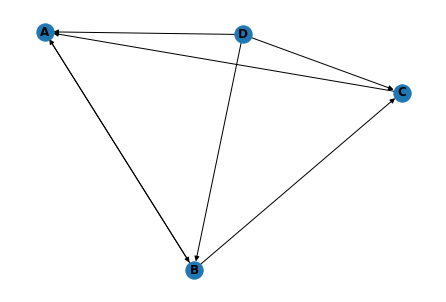
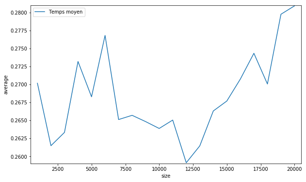

# PageRankEnsae


```python
import networkx as nx
import matplotlib.pyplot as plt
import numpy as np
import seaborn as sns
import pandas as pd
from tqdm import tqdm
import math
import sys
```

# Eléments logiciels pour le traitement des données massives
##### Melchior Prugniaud MS DS


La machine utilisé est une machine avec 32GB de RAM avec une carte graphique NVIDIA GeForce GTX 1080. Le processeur est un AMD Ryzen 7 1700 3GHz avec 8 coeurs. Au départ, ma volonté était de réaliser le projet sur Python puis de voir la différence avec PyCuda mais celà n'a pas fonctionné car mon installation semble avoir des problèmes avec la détection des librairies de C/C++. C'est pourquoi, le projet démarre sur python puis migre sur C pour enfin terminer sur un rendu en Cuda. 

# PageRank

### 1. Présentation de l'algorithme

PageRank est un algorithme inventé par les co-fondateurs de Google, Larry Page et son partenaire Sergey Brin. Il est utilisé pour analyser les liens d'un réseau internet ou d'un site (Ex : Twitter et les liens entre les différents utilisateurs). PageRank va prendre l'ensemble de ce réseau pour assigner un poids à chaque noeud ayant un poids montrant son importance dans le réseau. L'algorithme est utilisé par Google dans son moteur de recherche comme l'une des variables déterminant le rang d'apparition de la page.

Il représente la vraisemblance qu'une personne cliquant sur des liens puisse arriver à une page déterminée grâce à la sortie de l'algorithme qui est une distribution de probabilité. Il est possible de représenter un réseau à l'aide d'un graphe dirigé. En effet, prenons l'exemple issu de Wikipédia. Soit un réseau de quatre pages A, B, C et D avec B allant vers A et C. C allant vers A, A allant vers B et D allant vers les trois autres pages. Le graphique ci-dessous est la représentation de ce réseau. Il est aussi possible de représenter ce réseau sous la forme d'une matrice qui sera utilisé par la suite pour calculer les poids des différentes pages.


```python
G=nx.DiGraph()
G.add_nodes_from(['A','B','C','D'])
G.add_edges_from([('A','B'),('B','A'),('B','C'),('C','A'),('D','A'),('D','B'),('D','C')])
nx.draw(G, with_labels=True, font_weight='bold', arrows=True)
plt.show()
```

    C:\Users\franc\AppData\Local\Continuum\anaconda3\lib\site-packages\networkx\drawing\nx_pylab.py:579: MatplotlibDeprecationWarning: 
    The iterable function was deprecated in Matplotlib 3.1 and will be removed in 3.3. Use np.iterable instead.
      if not cb.iterable(width):
    C:\Users\franc\AppData\Local\Continuum\anaconda3\lib\site-packages\networkx\drawing\nx_pylab.py:676: MatplotlibDeprecationWarning: 
    The iterable function was deprecated in Matplotlib 3.1 and will be removed in 3.3. Use np.iterable instead.
      if cb.iterable(node_size):  # many node sizes
    





La matrice représente notre réseau avec en ligne les liens entrants vers la page X et en colonne les liens sortants vers la page X. A noter que par exemple pour la page D allant vers A, B et C, les liens sortants auront une valeur de 1/3 dans la matrice. On obtient alors :


```python
np.array([0,1/2,1,1/3,
          1,0,0,1/3,
          0,1/2,0,1/3,
          0,0,0,0]).reshape(4,4)
```


    array([[0.        , 0.5       , 1.        , 0.33333333],
           [1.        , 0.        , 0.        , 0.33333333],
           [0.        , 0.5       , 0.        , 0.33333333],
           [0.        , 0.        , 0.        , 0.        ]])


A partir de ces répresentations, on peut plus facilement calculer pour ce léger exemple le pagerank de A. Sachant qu'au départ nous avons initialisé les poids de tel manière tel qu'au départ leur valeur soit de 1/N donc 1/4. 

<center>
$ PR(A) = \frac{PR(B)}{2} + PR(C) + \frac{PR(D)}{3} $
</center>
Ainsi à la première itération, nous avons : 
<center>
$ PR(A) = \frac{0.25}{2} + 0.25 + \frac{0.25}{3} =  0.458 $
</center>
De manière plus général, il est possible d'écrire : 
<center>
$ PR(A) = \frac{PR(B)}{L(B)} + \frac{PR(C)}{L(C)} + \frac{PR(D)}{L(D)}$
</center>
Où L(N) représente le nombre de liens sortant de la page N. 

Ainsi, nous obtenons : 
<center>
$ PR(u) = \sum_{v \in B_u}\frac{PR(v)}{L(v)} $ 
</center>
Avec $ B_u $ l'ensemble des pages liant à u.

Etant donné que le PageRank simule la navigation d'une personne cliquant aléatoirement sur les différents liens, on instaure la probabilité d qu'une personne continue sa navigation est appelé 'dampling factor'. Différentes études on réussit à déterminer que le dampling factor optimal était 0.85 et nous allons donc définir d = 0.85 dans le reste de ce notebook. Au final, en ajoutant le dampling factor à la formule précédente on obtient : 

<center>
$ PR(p_i) = \frac{1-d}{N}+d \sum_{p_j \in M(p_i)}\frac{PR(p_j)}{L(p_j)} $ 

Avec N le nombre de page et $ M(p_i) $ l'ensemble de page connectant à $ p_i $. La somme des $ PR(p_i) $ est alors égale à 1.
</center>

Comme montré précédemment, il est possible d'écrire cette équation de manière matricielle. 

<center>
$$ R = \begin{bmatrix} \frac{(1-d)}{N} \\ \frac{(1-d)}{N} \\... \\ \frac{(1-d)}{N} \end{bmatrix} + d \begin{bmatrix} l(p_1,p_1) & l(p_1,p_2)  & ... & l(p_1,p_N)\\ l(p_2,p_1) & l(p_2,p_2)  & ... & l(p_2,p_N)\\ ... & ... & ... & ... \\ l(p_N,p_1) & l(p_N,p_2)  & ... & l(p_N,p_N)\\\end{bmatrix} R $$
</center>

Avec $ \sum_{i=1}^{N} l(p_i,p_j) = 1$


### 2.) Première implémentation

Dans un premier temps, nous allons implémenter l'algorithme sous python entièrement. Pour vérifier son bon fonctionnement, l'algorithme sera d'abord testé sur notre matrice m puis ensuite sur un jeu de données email.txt. Il reste assez petit, d'autres jeux de données plus grand peuvent être utilisés par la suite.
Les données sont tirés de https://snap.stanford.edu/data/. 

Dans un premier temps reprenons notre premier exemple et voyons les résultats que l'on peut obtenir. Cela nous permettra aussi de voir si nos différentes fonctions rendent les mêmes résultats.

Voici une version de l'algorithme utilisant la forme matricielle pour calculer le PageRank


```python
class PageRank:
    def __init__(self,m,max_iter = 10, d=0.15, e=0.00001,Verbose=False):
        self.d = d
        self.e = e
        self.max_it = max_iter
        self.Verbose=Verbose
        self.transitionWeights = pd.DataFrame(m)
    def ExtraireSommets(self,m):
        sommets = set()
        for colKey in m:
            sommets.add(colKey)
        for rowKey in m.T:
            sommets.add(rowKey)
        return sommets
    def norm(self,m):
        return m.div(m.sum(axis=1), axis=0)
    def MatriceCarree(self,m, sommets):
        m = m.copy()
        
        def ColonnesManquantes(m):
            for sommet in sommets:
                if not sommet in m:
                    m[sommet] = pd.Series(0, index=m.index)
            return m
        m = ColonnesManquantes(m) 
        m = ColonnesManquantes(m.T).T 
        return m.fillna(0)
    def CheckLignePositive(self,m):
        m = m.T
        for colKey in m:
            if m[colKey].sum() == 0.0:
                m[colKey] = pd.Series(np.ones(len(m[colKey])), index=m.index)
        return m.T
    def euclideanNorm(self,series):
        return math.sqrt(series.dot(series))
    def Initialisation(self,sommets):
        startProb = 1.0 / float(len(sommets))
        return pd.Series({node : startProb for node in sommets})
    def RandomSurfer(self,sommets, transitionProbabilities, rsp):
        alpha = 1.0 / float(len(sommets)) * self.d
        return transitionProbabilities.copy().multiply(1.0 - self.d) + alpha
    def main(self):
        ma = self.transitionWeights
        sommets = self.ExtraireSommets(ma)
        ma = self.MatriceCarree(ma, sommets)
        ma = self.CheckLignePositive(ma)
        state = self.Initialisation(sommets)
        transitionProbabilities = self.norm(ma)
        transitionProbabilities = self.RandomSurfer(sommets, transitionProbabilities, self.d)
        for iteration in range(self.max_it):
            oldState = state.copy()
            state = state.dot(transitionProbabilities)
            delta = state - oldState
            if self.euclideanNorm(delta) < self.e:
                if self.Verbose ==True:
                    print("Pas de changement après l itération numéro : ", iteration)
                break
        return state
```


```python
m = np.array([0,1/2,1,1/3,
          1,0,0,1/3,
          0,1/2,0,1/3,
          0,0,0,0]).reshape(4,4)
m = np.matrix(m)
m
```


    matrix([[0.        , 0.5       , 1.        , 0.33333333],
            [1.        , 0.        , 0.        , 0.33333333],
            [0.        , 0.5       , 0.        , 0.33333333],
            [0.        , 0.        , 0.        , 0.        ]])


```python
m = np.array([0,1,1,1,1,0,0,1,0,1,0,1,0,0,0,0]).reshape(4,4)
m
```


    array([[0, 1, 1, 1],
           [1, 0, 0, 1],
           [0, 1, 0, 1],
           [0, 0, 0, 0]])


On obtiens donc le PageRank suivant pour 10 itérations. La somme des différents PR fait bien un. Nous pouvons remarquer que les différents coefficients des PageRank ne varie presque pas pour notre cas au dela de 10 itérations.


```python
PR = PageRank(m).main()
print(PR, PR.sum())
```

    0    0.219240
    1    0.249702
    2    0.175232
    3    0.355827
    dtype: float64 0.9999999999999996
    


```python
PageRank(m,100).main()
```


    0    0.219237
    1    0.249705
    2    0.175231
    3    0.355828
    dtype: float64


Désormais, nous allons nous intéresser au jeu de données email.txt et mesurer le temps d'éxecution pour ce jeu de données. Pour se faire nous créeons une fonction basique permettant à partir d'un DataFrame d'obtenir la matrice nécessaire aux calculs du PageRank. Pour allons ensuite mesurer son temps d'exécution sur les données à la fois de Wikipédia mais aussi de Google qui sont bien plus volumineuses.


```python
def csv_to_graph(file_name,delim,header=False):
    col=[]
    maxi=0
    with open(file_name,'r') as f:
        lignes = f.readlines()
        j=0
        for ligne in lignes:
            j+=1
            ligne = ligne.replace('\n','')
            cols = ligne.split(delim)
            if header == True:
                header = False
                continue
            col+=[(int(cols[0]),int(cols[1]))]
            if maxi < int(cols[0]):
                maxi = int(cols[0])
            elif maxi < int(cols[1]):
                maxi = int(cols[1])
    return col,maxi+1
def csv_to_PR(file_name,delim,max_iter =10,Verbose=True):    
    col,maxi = csv_to_graph(file_name,delim,header=False)
    m=np.zeros(maxi**2).reshape(maxi,maxi)
    for i in col:
        m[i[0]][i[1]]=1
    m = np.matrix(m)
    return PageRank(m,max_iter =max_iter).main()
v = csv_to_PR('email.txt',' ',max_iter =10)
v.sum()
```


    0.9999999999999973


Je reprends une fonction créée par vous même permettant de mesurer le temps d'exécution moyen. 


```python
def measure_time(stmt, context, repeat=10, number=50, div_by_number=False):
    from timeit import Timer
    """
    Fonction crée par Xavier Duprée disponible avec d'autres ici : https://github.com/sdpython/cpyquickhelper
    """
    import numpy  # pylint: disable=C0415
    tim = Timer(stmt, globals=context)
    res = numpy.array(tim.repeat(repeat=repeat, number=number))
    if div_by_number:
        res /= number
    mean = numpy.mean(res)
    dev = numpy.mean(res ** 2)
    dev = (dev - mean**2) ** 0.5
    mes = dict(average=mean, deviation=dev, min_exec=numpy.min(res),
               max_exec=numpy.max(res), repeat=repeat, number=number)
    if 'values' in context:
        if hasattr(context['values'], 'shape'):
            mes['size'] = context['values'].shape[0]
        else:
            mes['size'] = len(context['values'])
    else:
        mes['context_size'] = sys.getsizeof(context)
    return mes

```

Nous réalisons donc un comparatif des performances pour l'ensemble des trois datasets que nous avons sélectionnés.


```python
rows = []
for n in tqdm(list(range(1000, 20001, 1000))):
    res = measure_time('csv_to_PR(m,delim,Verbose=False)',
                       {'m': 'email.txt', 'delim':' ','csv_to_PR': csv_to_PR,'Verbose':False},
                       div_by_number=True,
                       number=10)
    res["size"] = n
    rows.append(res)
df = pd.DataFrame(rows)
plt.figure(figsize=(10,6))
sns.lineplot(y=df.average,x=df["size"],label = 'Temps moyen')
plt.ylim(df.average.min()-0.0001,df.average.max()+0.0001)
plt.xlim(df['size'].min()-500,df['size'].max()+500)
plt.show()
```

    100%|██████████████████████████████████████████████████████████████████████████████████| 20/20 [08:56<00:00, 26.85s/it]
    




### 3.) Implémentation sous C

Dans un premier temps, j'ai réalisé un fichier en C++ permettant de réaliser le PageRank. Il prend en entrée un fichier texte à renseigner, demande ensuite le nombre maximale d'itérations choisis et réalise le PageRank. A noter qu'il faut manuellement renseigner le nombre de sommets du fichier. Une version sans cette manipulation est disponible dans le fichier 'PageRankAuto.cpp' mais étant donné que je n'arrivais pas bien à implémenter les vecteurs avec Cuda, la version qui sert de comparatif avec cuda est 'PageRank.cpp'. 

La base issu du fichier email.txt se compose de 1004 sommets pour un total de 25 571 arrêtes. En utilisant le code réalisé sous Python, on remarque un temps d'exécution d'environ 250 simillisecondes. Avec notre code en C++, le temps d'exécution est de millisecondes.
Sur la base email.txt, le temps de traitement est de 409.753 millisecondes. Il est alors facile de remarque

